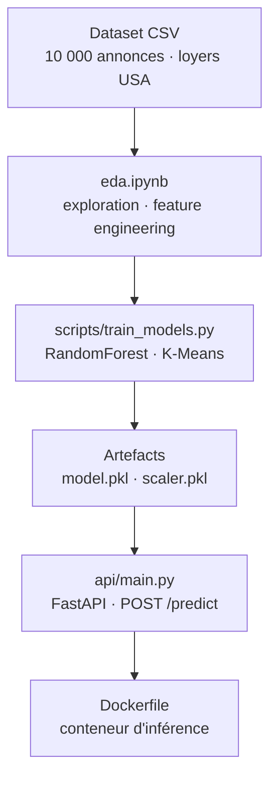

# Exam Final Python - Prédiction des Lovyers USA

<!-- adam-badges:start -->
[](https://github.com/Adam-Blf/exam_final_python/commits) [](https://hits.sh/github.com/Adam-Blf/exam_final_python/) [](https://github.com/Adam-Blf/exam_final_python/commits) [](https://github.com/Adam-Blf/exam_final_python) [](LICENSE)
<!-- adam-badges:end -->


[](https://www.efrei.fr/)


## Description

Projet d'évaluation finale en Data Science. L'objectif est de prédire le prix des loyers d'appartements aux États-Unis à partir d'un jeu de données de 10 000 annonces immobilières. Le projet inclut une analyse exploratoire (EDA), la construction de modèles de Machine Learning (supervisés et non supervisés), et le déploiement d'une API FastAPI.

Auteurs: Adam Beloucif et Emilien MORICE.

## Architecture



## Features

- [x] Analyse Exploratoire des Données (EDA) interactive via Jupyter Notebook
- [x] Pre-processing & Feature Engineering robustes
- [x] Modèles Supervisés (Régression, Arbre, Random Forest avec R² = 0.72)
- [x] Modélisation Non Supervisée (Clustering K-Means)
- [x] Serveur d'inférence API FastAPI
- [x] Fichiers configurés pour un ciblage Docker rapide
- [x] Rapport d'analyse Métier

## Installation

```bash
# 1. Installer les dépendances
pip install -r requirements.txt

# 2. Entraîner les modèles (génère model.pkl et scaler.pkl ainsi que les graphiques)
python scripts/train_models.py

# 3. Lancer l'API
uvicorn api.main:app --reload
```

## Structure du Dépôt

- `eda.ipynb` : Notebook de l'Exploration des Données.
- `scripts/train_models.py` : Entraînement des modèles.
- `api/main.py` : Code de l'API déployée.
- `rapport_analyse_business.md` : Conséquences métier et interprétation des modèles.
- `requirements.txt` & `Dockerfile` : Configuration et Déploiement.

## Requête cURL de test pour l'API

```bash
curl -X 'POST' \
  'http://127.0.0.1:8000/predict' \
  -H 'accept: application/json' \
  -H 'Content-Type: application/json' \
  -d '{
  "bathrooms": 1,
  "bedrooms": 2,
  "square_feet": 1050,
  "latitude": 38.905,
  "longitude": -76.986
}'
```

## Tech Stack

- Python 3.10
- Pandas, Scikit-learn, Matplotlib, Seaborn
- FastAPI, Pydantic, Uvicorn
- Docker

## Changelog

### 2026-02-26

- Initial release: Implémentation du pipeline Data Science complet et exposition via API FastAPI. Écriture du rapport Business.


---

<p align="center">
  <sub>Par <a href="https://adam.beloucif.com">Adam Beloucif</a> · Data Engineer & Fullstack Developer · <a href="https://github.com/Adam-Blf">GitHub</a> · <a href="https://www.linkedin.com/in/adambeloucif/">LinkedIn</a></sub>
</p>