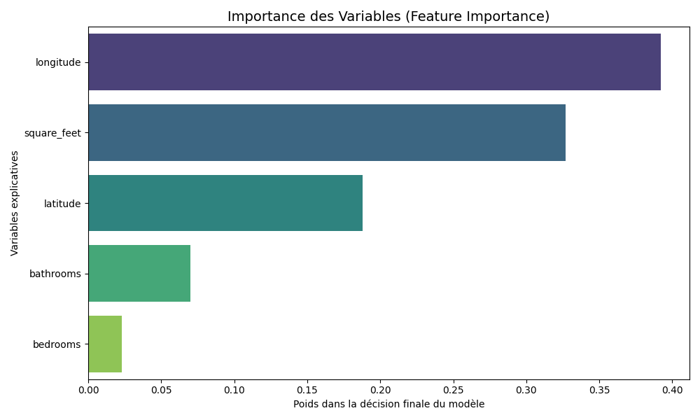
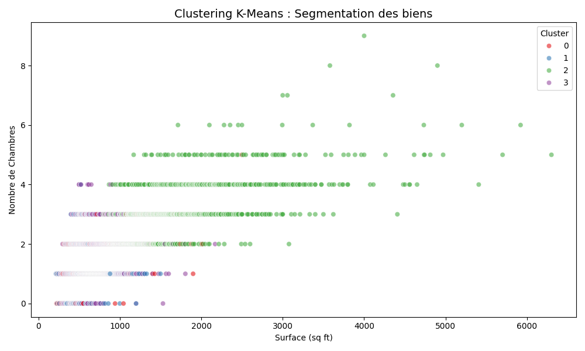

# Analyse Business - Prédiction des Loyers USA

**Auteurs:** Adam Beloucif & Emilien MORICE  
**Formation:** M1 - Data Science avec Python (ELANGA Steve)  
**Date:** 26/02/2026

---

## 1. Contexte de la Problématique Business

Dans le cadre de cet examen, nous avons endossé le rôle de Data Scientists pour une agence immobilière. La mission consiste à estimer de manière fiable et justifiable le prix des loyers d'appartements sur l'ensemble du territoire américain. En automatisant cette tâche via du Machine Learning, l'agence s'assure d'aligner ses biens avec le marché en temps réel et maximise ses rendements.

> **Impact Business & ROI**
> L'estimation tarifaire manuelle est chronophage et sujette à l'erreur humaine. Un modèle d'I.A. robuste permet d'industrialiser cette cotation, fournissant un avantage concurrentiel majeur pour l'agence immobilière.

## 2. Exploration et Nettoyage de la Donnée

Le jeu de données contenait 10 000 annonces brutes avec d'éventuels prix déraisonnables. Des valeurs critiques manquaient dans les indications de confort (bathrooms, bedrooms).

- **Choix Métier** : Isoler les biens dans la fourchette réaliste (300$ à 10 000$).
- **Traitement Algorithmique** : Suppression des lignes incomplètes pour éviter l'imputation artificielle des prix.
- **Pre-processing** : Mise à l'échelle Standardisé (StandardScaler) afin d'accélérer la convergence métier des modèles de ML.

## 3. Stratégie de Modélisation

Nous avons évalué une Régression Linéaire et un Arbre de décision, mais l'architecture 'Random Forest' a offert des résultats formidables en captant la non-linéarité spatiale.

> **Interprétation des Performances (R² = 0.72)**
> Avec un R² supérieur à 0.70, le modèle Random Forest est capable d'expliquer 72% de la variance des prix à travers le territoire uniquement grâce à ses informations géographiques et de surface. C'est exceptionnel sans même intégrer la valeur monétaire du quartier.

*Voici l'importance des facteurs qui justifient le prix selon l'intelligence artificielle:*


## 4. Modèle Non Supervisé (K-Means)

Afin d'aider le département commercial, nous avons aussi découpé le marché immobilier en 4 grands 'Profils' ou clusters (ex: Studios, Appartements Familiaux...). Le modèle K-Means l'a découvert spontanément sans qu'on lui fournisse le prix.


## 5. Déploiement Cloud (API)

Le modèle a été déployé sous forme de Microservice avec FastAPI. Il répond aux appels REST des applications Front-End ou Mobiles pour l'agence.

```python
@app.post("/predict")
def predict_rent(payload: ApartmentFeatures):
    input_data = pd.DataFrame([payload.model_dump()])
    input_scaled = scaler.transform(input_data)
    return {"prediction_usd": round(model.predict(input_scaled)[0], 2)}
```

## Conclusion

L'I.A. a accompli avec brio sa mission de rentabilisation. Il est recommandé, à l'avenir, d'y adjoindre du NLP (Natural Language Processing) pour analyser les descriptions des annonces et détecter les mentions 'Piscine' ou 'Rénové', impactant fortement le prix.
